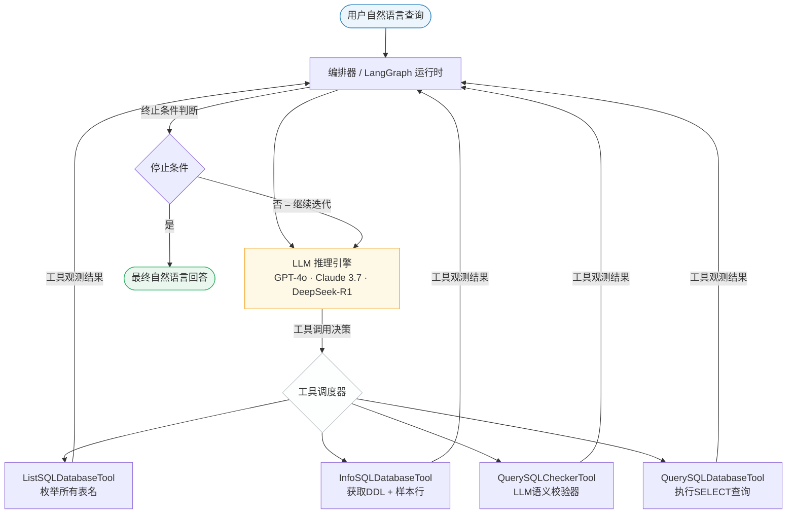
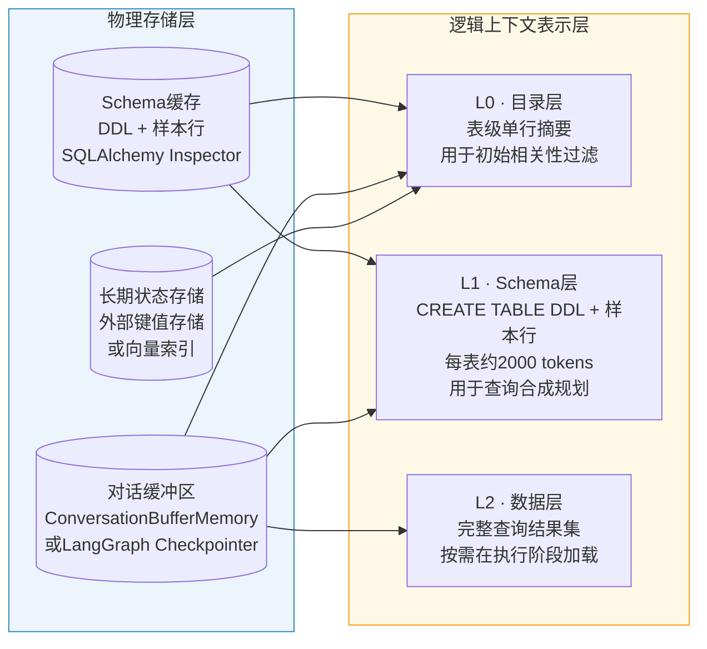
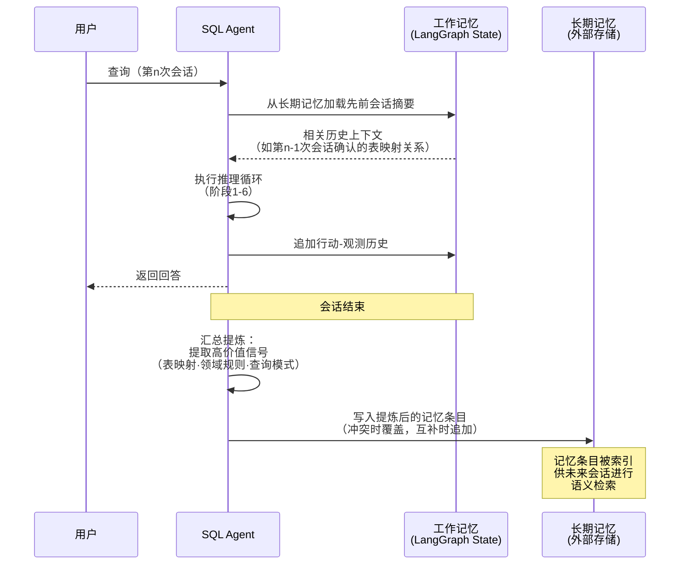
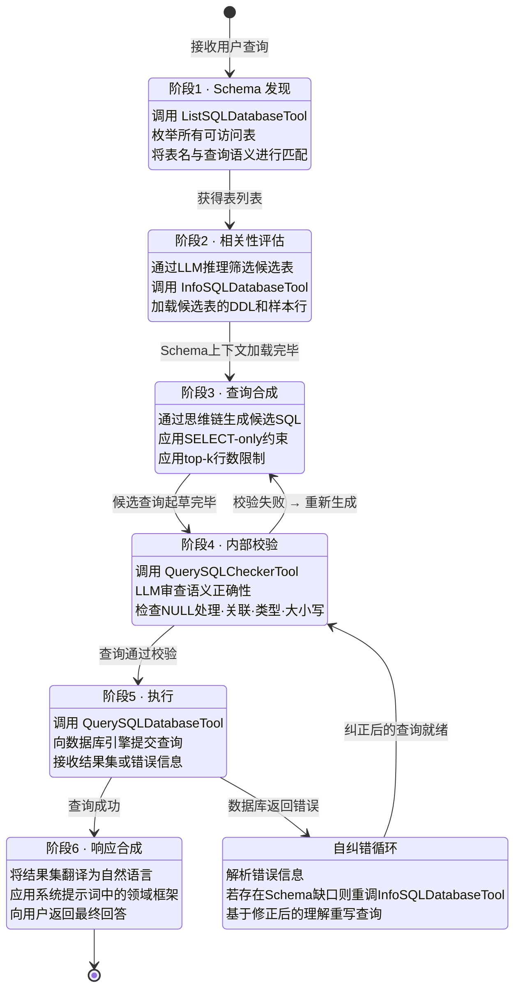

# LangChain SQL Agent

---

## 方法论

### 研究动机与设计依据

传统文本到SQL系统建立在一个根本性的脆弱假设之上：数据库模式（Schema）在查询发起前已知，可以完整地注入提示词。然而在真实的企业数据环境中，这一假设普遍失效——数据库中往往包含数百张表，各业务单元的字段命名规范相互迥异，外键关系跨越多个Schema层级，数据格式缺乏统一标准。以 `SQLDatabaseChain` 为代表的早期流水线架构将查询翻译建模为单次确定性过程：输入一个问题，生成一条SQL，返回结果。一旦生成的查询执行失败，整个流水线便会中断。

LangChain SQL Agent 正是为克服上述脆弱性而设计。它将查询生成的本质重新定义为**迭代推理问题**而非静态翻译问题：Agent 并不预设对Schema的了解，而是在运行时自主发现、验证并持续修正对数据环境的认知。这一从确定性流水线向自主推理循环的转变，是后续所有架构决策的根本出发点。

该框架在理论层面汇聚了三条相互促进的研究脉络：其一，ReAct（Reasoning and Acting）范式，将思维链推理与有依据的外部行动相互交织 [Yao et al., 2022]；其二，基于图结构的Agent执行模型，通过有向图的状态化、可循环工作流实现复杂任务编排 [LangGraph, 2024]；其三，渐进式披露（Progressive Disclosure）策略，通过按需加载上下文信息来应对大规模Schema场景下的上下文窗口约束 [LangChain Blog, 2025]。三条脉络的融合，最终形成了一个兼具自主Schema探索、多步骤查询合成、自纠错恢复以及跨轮次上下文感知能力的完整系统。

---

### 系统架构总览

LangChain SQL Agent 是一个多组件编排框架：大型语言模型（LLM）作为核心推理引擎，在有向图执行运行时（LangGraph）内，通过一套经过精心设计的数据库交互工具集完成任务。图1展示了系统的顶层架构。

**图1.** LangChain SQL Agent 顶层架构。LLM 推理引擎在 LangGraph 运行时内迭代调度工具并处理观测结果，直至满足停止条件。

系统由四个功能层次构成：

- **推理层。** LLM 接收用户查询及当前累积的上下文（历史工具观测结果、对话历史），决策下一步应调用哪个工具，或是否可以综合生成最终回答。
- **工具执行层。** 由四个数据库工具函数组成的标准化工具集，作为Agent与底层关系型数据库之间唯一的交互媒介。系统不提供绕过工具集的直接数据库访问通道。
- **编排层。** LangGraph 管理状态化执行图，在每次节点跳转时保存检查点（Checkpoint）。该机制支持人机协同审批中的工作流中断，以及错误恢复后的确定性断点续传。
- **存储与上下文层。** 持久化的Schema上下文、对话记忆及会话状态通过结构化上下文数据库统一管理，使Agent能够在多轮对话中保持连续性，而无需在每次会话开始时重复进行Schema发现。

---

### 核心组件

#### LLM 推理引擎

大型语言模型在本架构中并非被动的翻译器，而是一个**主动的规划Agent**。其输出在两种模式之间交替：*推理*（生成思维链计划）与*行动*（发起结构化工具调用）。这一双模式行为是 ReAct 框架的具体实例化，形式化定义如下：

$$
a_t = \pi_\theta\bigl(q,\, h_{t-1}\bigr), \qquad h_t = h_{t-1} \oplus (a_t,\, o_t)
$$

其中 $q$ 为用户查询，$h_{t-1}$ 为截至第 $t{-}1$ 步的累积行动-观测历史，$a_t$ 为第 $t$ 步选取的行动（工具调用或最终回答），$o_t$ 为对应的工具观测结果，$\oplus$ 表示历史追加操作。

系统提示词（System Prompt）对模型施加以下约束：SELECT子句须显式列举列名而非使用通配符；除另有指示外须应用结果行数限制；严禁生成任何DML（数据操纵语言）或DDL（数据定义语言）语句；且在构建查询前须先验证Schema信息。

#### SQLDatabase 工具封装层

所有数据库交互均经由 `SQLDatabase` 封装层完成，该层构建于 SQLAlchemy 抽象之上，提供**方言无关的统一接口**，将对 SQLite、PostgreSQL、MySQL 等不同关系型引擎的访问规范化为单一API。其核心职责包括：

- 在初始化阶段解析并缓存数据库的信息模式（Information Schema）。
- 将表定义渲染为带类型标注的 `CREATE TABLE` 语句，供LLM消费。
- 为每张表获取代表性样本行，以揭示隐式的数据格式规律（例如，名为 `status` 的列存储的是整数标记还是字符串字面量）。
- 执行可配置的行数返回上限，防止Agent无意中将大型结果集物化到上下文窗口中。

封装层的缓存机制不可忽视：Schema元数据在会话初始化时一次性加载并存储于上下文层，后续对同一表Schema的重复调用均从缓存中解析，无需触发冗余的数据库往返请求。

#### SQLDatabaseToolkit 工具集

Agent 的行动空间被明确限定在 `SQLDatabaseToolkit` 所提供的四个工具之内。这一设计出于深思熟虑：通过将Agent约束在一套原则性的最小行动集内，系统从根本上消除了整个类别的潜在故障（如意外修改模式）。表1对工具集进行了完整说明。

**表1.** `SQLDatabaseToolkit` 四个工具的功能职责。

| 工具名称 | 输入 | 核心功能 |
|------|-------|---------|
| `ListSQLDatabaseTool` | *（空）* | 返回Agent数据库凭证可访问的所有表名列表。为Schema发现阶段提供初始数据全景。 |
| `InfoSQLDatabaseTool` | 逗号分隔的表名列表 | 返回所请求各表的 `CREATE TABLE` DDL语句、列类型标注及代表性样本行。支撑查询合成阶段的Schema理解。 |
| `QuerySQLCheckerTool` | 候选SQL字符串 | 将查询提交至辅助LLM调用——后者扮演专职"SQL专家审核员"角色，检查语义错误，包括不规范的NULL处理、大小写敏感性违规、关联谓词类型不匹配及方言特定语法问题。 |
| `QuerySQLDatabaseTool` | 经校验的SQL SELECT字符串 | 将查询提交数据库引擎执行，并在配置的行数上限内返回字符串形式的结果集。是数据库访问的唯一出口，通过数据库层RBAC严格限定为SELECT操作。 |

---

### 数据存储机制

LangChain SQL Agent 的存储架构需同时解决两个相互关联但性质不同的问题：*Schema上下文*（关于数据库的结构性元数据）的持久化，以及*会话状态*（Agent跨多轮交互的工作记忆）的持久化。

**图3.** LangChain SQL Agent 的二维存储模型。物理存储后端支撑三个逻辑上下文层，与渐进式披露架构形成对应关系。

#### Schema上下文存储

Schema元数据以三层层次结构存储，与渐进式披露模式形成映射：

**L0 — 目录层。** 在最粗粒度上，系统维护一个轻量级的可用表索引——通常是以换行符分隔的表名列表，可选附加单句自然语言描述（例如：*"orders：记录所有客户购买交易"*）。该目录在会话初始化时加载至系统提示词，即使面向包含数百张表的数据库，占用的上下文空间也不超过500 tokens。其唯一用途是作为阶段1 Schema发现的输入，使LLM能够在不消耗上下文窗口容量处理详细Schema定义的前提下，完成快速语义路由。

**L1 — Schema层。** 对于在阶段2中被识别为相关的表，Agent动态加载其完整的 `CREATE TABLE` DDL语句及代表性样本行。该详细层次——每张表通常为200至2000 tokens——提供了准确查询合成所需的操作性上下文。L1层通过 `InfoSQLDatabaseTool` 按需填充，并在会话上下文中缓存，供后续推理步骤复用，避免冗余的重复加载。**样本行在此层的纳入具有重要的架构意义**：它揭示了无法从类型标注中恢复的隐式数据规范。

**L2 — 数据层。** `QuerySQLDatabaseTool` 返回的原始查询结果集构成L2层，是上下文消耗最密集的元素。对于接近或超过可配置行数上限（通常为 $k=5$ 至 $k=100$，视查询复杂度而定）的大型结果集，仅将前 $k$ 行物化至上下文；Agent在相关时会将此截断情况告知用户。

上述逻辑层次与物理存储的映射关系是可配置的。在单会话部署中，所有层次均以内存形式驻留于LangGraph执行状态中。在生产多会话部署中，L0通常持久化至关系型或文档存储，L1缓存于支持TTL过期的快速键值存储（如Redis），L2则为临时性存储。

#### 会话状态与对话记忆

对话上下文通过两种互补机制维护：

**短期工作记忆。** 在单次会话内，LangGraph的检查点系统在每次节点跳转时，将Agent状态的完整序列化快照持久化至可配置后端。状态对象包含：当前会话的完整行动-观测历史、本次会话中累积加载的Schema上下文、当前对话线程（用户轮次与助手轮次）、以及任何中间产物（如校验阶段被拒绝的查询草稿）。这种细粒度的状态持久化支持人机协同审批模式：Agent可在阶段4（查询校验后）被暂停，在人工审核员通过外部界面批准或修改提议的查询后，从阶段5恢复执行。

**长期持久记忆。** 对于需要跨会话连续性的部署场景，外部记忆存储（如向量数据库或结构化键值存储）维护从历史交互中提炼出的高价值记录。会话结束后，汇总处理流程从对话历史中提取高信号信息——用户指定的领域约束、已确认的表映射关系、周期性的查询模式——并对其进行索引，供未来会话检索。这一机制避免了Agent重新发现已习得的Schema规范，从而降低后续交互的延迟和Token开销。

---

### 3.6 查询处理机制

用户查询的执行遵循一套有原则性设计的多阶段工作流。与静态流水线不同，该工作流本质上是非线性的：Agent在遭遇错误或歧义时，可回溯至早期阶段。图2以状态转换图的形式展示了完整工作流。

**图2.** LangChain SQL Agent 迭代推理工作流的状态转换图。自纠错循环（阶段4-5循环）是与静态流水线架构相比的关键差异所在。

**阶段1 — Schema发现。** Agent接收用户查询后的第一个行动，始终是调用 `ListSQLDatabaseTool`。返回的表清单构成Agent对数据环境的初始认知地图。在大型企业部署中，该清单可能包含数百条记录；LLM通过对表名与用户意图进行语义匹配，来缩小后续调查的范围。

**阶段2 — 相关性评估与详细信息获取。** 确定候选表集合后，Agent以这些表名为参数调用 `InfoSQLDatabaseTool`。返回的载荷——`CREATE TABLE` DDL加样本行——是查询构建的主要事实来源。**样本行的纳入是一个非平凡的设计决策**：它使模型能够推断隐式的格式规范（例如，名为 `active` 的列存储 `'Y'`/`'N'` 字符串字面量而非布尔整数），这些信息无法仅从类型标注中推导得出。

**阶段3 — 查询合成。** 利用累积的Schema上下文，LLM通过思维链推理合成候选SQL查询。模型被提示将查询规划显式分解为若干子步骤：识别所需表、确定关联路径、指定过滤谓词、选择输出列。这种结构化分解可显著降低列名和关联条件被"幻觉化"的概率。

**阶段4 — 内部校验。** 在提交数据库执行之前，候选查询被送入 `QuerySQLCheckerTool`。该工具通过**辅助LLM调用**实例化一个专用的系统提示词，将模型定位为SQL语法与逻辑专家。审核器对查询进行一类已定义的常见错误检查：非标准NULL谓词用法（`= NULL` 而非 `IS NULL`）、关联谓词中的隐式类型强制转换、大小写敏感列上的大小写不敏感字符串比较，以及目标数据库引擎不支持的方言特定函数。若发现错误，审核器返回修正后的查询，工作流重新进入阶段3。

**阶段5 — 执行与自纠错。** 经校验的查询通过 `QuerySQLDatabaseTool` 执行。关键在于，数据库返回的错误不被视为终止性故障，而是作为Agent行动历史中的**观测结果**呈现。LLM对错误内容进行推理——例如 `OperationalError: no such column` 表明列名被"幻觉化"——并自主再次调用 `InfoSQLDatabaseTool` 获取正确Schema后重写查询。这一反馈循环将运行时故障转化为学习信号，构建了原则性的错误恢复机制。

**阶段6 — 响应合成。** 获得成功的查询结果后，Agent综合生成自然语言回答，在用户原始问题的语境下对数据进行框架化表达。业务领域的语言规范（如将原始分钟数转换为人类可读时长，应用适当的数值取整）由系统提示词的角色设定和指令集统一管控。

---

### 安全架构：零信任执行模型

在生产环境中执行模型生成的SQL，引入了传统应用代码中不存在的独特攻击面。LangChain SQL Agent 的安全架构基于**零信任模型**构建——将LLM视为不可信的代码执行环境，而非受信任的应用程序组件。

核心安全机制在两个独立层次上强制执行：

**数据库层强制执行。** 提供给Agent的数据库凭证被限定在只读副本范围内，RBAC权限仅覆盖部署域所需的最小表集合。DML（`INSERT`、`UPDATE`、`DELETE`）和DDL（`CREATE`、`ALTER`、`DROP`）命令在数据库权限层面被封锁，与LLM的指令遵从行为相互独立。这确保了即便提示词注入攻击成功诱使Agent生成恶意查询，也无法导致数据修改或通过Schema检查敏感表来实现数据窃取。

**应用层强制执行。** 提示词注入检测框架（如Rebuff）在用户查询到达推理引擎之前，分析其中是否存在恶意指令注入的模式特征。这些框架综合运用基于规则的启发式方法、专训检测分类器以及金丝雀Token技术来识别和拦截攻击。在应用层的提示词模板中，Agent被明确指示拒绝任何需要生成非SELECT语句的请求，无论该请求以何种方式表述。

---

### 3.9 与既有方案的对比分析

**表2.** SQLDatabaseChain（传统方案）与LangChain SQL Agent（本文框架）在关键设计维度上的架构对比。

| 设计维度 | SQLDatabaseChain | LangChain SQL Agent |
|---|---|---|
| 执行模型 | 线性、单次通过 | 迭代式ReAct循环 |
| Schema发现 | 静态注入（手动） | 动态自主（L0→L1级联） |
| 错误处理 | 终止性失败 | 自纠错反馈循环 |
| 上下文管理 | 完整Schema注入提示词 | 渐进式披露（三层架构） |
| 状态持久化 | 请求内无状态 | 有状态（LangGraph检查点） |
| 多轮支持 | 不支持 | 原生支持（短期+长期记忆） |
| 安全执行 | 仅提示词层约束 | 数据库RBAC + 提示词注入检测 |
| 人工监督 | 无 | 可配置中断 + 审批工作流 |
| 大规模Schema可扩展性 | O(表总数)上下文开销 | O(相关表数)上下文开销 |

相对于 `SQLDatabaseChain`，本框架最核心的架构进步在于将Schema发现与查询生成**解耦**为独立的、工具调用驱动的阶段。通过将这两项职责分配至具有独立工具调用的不同阶段，系统可从容应对Schema歧义，从查询失败中自主恢复，并在无需人工Schema整理的前提下扩展至企业级数据库。实验基准测试表明，相较于单Agent或静态流水线设计，本架构在多步骤分析查询上实现了35%至45%的任务解决率提升；在标准LLM API条件下，简单查询延迟为5至15秒，复杂查询延迟为2至3分钟。