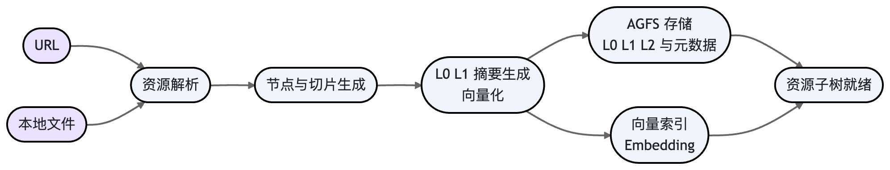

# Openviking

OpenViking 是字节跳动火山引擎 Viking 团队于 2026 年开源的一个面向 AI Agent 的上下文数据库（Context Database）。随着 AI Agent 从简单对话系统发展为能够执行长周期任务、调用工具并处理复杂数据的智能体，开发者逐渐发现传统的上下文管理方式难以支撑这些需求：记忆、资源和技能往往分散在代码、向量数据库和工具系统中，导致上下文难以统一管理和高效利用。OpenViking 正是在这一背景下提出，目标是为 Agent 提供一个统一的上下文管理基础设施，从而简化复杂的上下文工程问题。

与传统依赖扁平化文本切片和向量存储的 RAG 架构不同，OpenViking 提出一种 “文件系统范式”：将 Agent 所需的记忆（Memory）、资源（Resource）和技能（Skill）统一抽象为文件，并在虚拟文件系统中进行层次化组织和管理。通过这种方式，Agent 可以像操作文件系统一样浏览、检索和读取上下文，从而实现更稳定、可扩展的上下文管理机制。该设计理念旨在为 AI Agent 构建一个结构化、可持续演化的“外部大脑”，让开发者能够更专注于业务逻辑，而不必反复处理复杂的上下文管理问题。

## 数据的存储机制 

OpenViking 的存储设计可以概括为：逻辑上是带有多层摘要的虚拟文件系统，物理上由可插拔的文件后端和向量索引后端构成。
### 文件系统范式与虚拟 URI

所有信息，无论是外部资源（文档、代码）、Agent 的记忆还是技能定义，都被统一组织在一棵以 viking:// 为根的虚拟目录树下。每个信息单元都拥有一个唯一的 URI，例如：

- viking://resources/my_project/src/main.py

- viking://memory/facts/user_preferences.md

这种设计使得 Agent 可以像开发者操作本地文件一样，通过 ls、find 等指令来定位和管理上下文，操作直观且可追溯。
### L0/L1/L2 三层内容持久化

当一个资源（如一个 URL 或本地文件）被添加到 OpenViking 时，系统会自动进行切片和解析，并为每个生成的节点（无论是目录还是文件）创建三层不同粒度的内容并进行持久化存储：

- L0 (摘要层)：一句话概括，通常在100 Token 以内，用于在检索时进行快速的相关性判断。
- L1 (概述层)：结构化的概览信息，包含核心要点、使用场景等，约 2000 Token，供 Agent 在规划阶段进行决策。
- L2 (详情层)：未经修改的原始数据，供 Agent 在确认有必要时深入读取和分析。
    这三层内容与节点元数据一同被存储，构成了 OpenViking 的基本数据单元。

### 可插拔的物理后端

OpenViking 的物理存储分为两部分，均支持多种后端实现，以适应不同规模和部署环境的需求。
| 后端类型      | 内置选项               | 说明                                                         |
| ------------- | ---------------------- | ------------------------------------------------------------ |
| AGFS 文件后端 | local, s3fs            | 负责存储 L0/L1/L2 的实际内容、目录结构、文件元数据等。本地模式适用于快速开始和中小型应用，S3 模式则为生产环境提供了高可用和可扩展的存储方案。 |
| 向量索引后端  | local,http, volcengine | 负责存储每个资源节点或切片的嵌入向量（Embedding），以支持语义检索。本地模式使用内存或本地文件索引；HTTP 模式允许接入任何兼容的远程向量检索服务；volcengine模式则直接对接火山引擎的 VikingDB 服务，提供企业级的性能和稳定性。 |

### 存储流程与示例

当执行 add_resource 时，数据流入 OpenViking 的完整过程如下图所示。



以下是一个最小化的存储流程代码示例，展示了如何添加一个资源并等待其处理完成：

```python   
import openviking as ov

# 初始化客户端，使用本地存储
client = ov.OpenViking(path="./data")
client.initialize()

# 1. 添加一个在线资源
res = client.add_resource(path="https://raw.githubusercontent.com/volcengine/OpenViking/main/README.md")
root_uri = res["root_uri"]

# 2. 等待异步的语义处理完成（包括L0/L1摘要生成和向量化）
print("Waiting for processing...")
client.wait_processed()
print("Processing finished.")

# 此后，该资源的L0/L1/L2内容和向量均已持久化到后端
client.close()
```

## 数据的查询机制

OpenViking 的查询核心是其创新的“目录递归检索”策略，它结合了传统文件系统检索的精确性和向量检索的语义理解能力。
### 目录递归检索

OpenViking在高级查询模式中采用一种称为目录递归检索（Directory Recursive Retrieval）的机制。与传统 RAG 在全局向量空间中直接进行扁平化检索不同，该机制会结合 OpenViking 的文件系统结构，通过逐层缩小检索范围来定位最相关的上下文，从而提高检索的准确性和稳定性。

当用户发起查询时，系统首先会将查询文本转换为语义向量，并在向量数据库中执行初步的相似度搜索，以找到与查询语义最相关的一组上下文节点。这些节点可能对应某个目录、文件或资源摘要节点。系统并不会直接返回这些结果，而是根据它们的 URI 信息定位到相关的目录路径，从而确定可能包含目标信息的上下文区域。

在确定相关目录之后，系统会在该目录内部进行更细粒度的检索，对目录中的文件节点、子目录节点以及摘要信息进行进一步匹配。如果某些子目录的相关度评分较高，系统会继续向这些子目录递归深入，并重复检索过程，逐步缩小搜索范围，直到找到最精确匹配的内容节点。最终，系统会对所有候选结果进行排序和筛选，并返回最相关的上下文。

通过这种 “先定位相关区域，再逐层深入检索” 的方式，OpenViking 能够同时利用语义相似度和文档结构信息。相比传统依赖扁平文本切片的 RAG 方法，这种结构化检索方式能够有效降低噪声结果，并在大型知识库、复杂项目结构或代码仓库等场景中显著提升检索效果。
### 按需分层加载

在整个检索过程中，L0/L1/L2 的分层设计起到了关键的成本控制作用：

- 粗筛：在初步定位和目录扫描阶段，Agent 主要依赖 L0 摘要来快速过滤掉不相关的内容。
- 决策：当需要对候选节点进行评估和规划时，Agent 会加载 L1 概览来获取更丰富的结构化信息。
- 执行：只有当 Agent 确定需要某个节点的具体内容来完成任务时，才会加载 L2 的原始数据。

这个机制确保了在信息完整性和 Token 成本之间取得最佳平衡。
### API 形态与查询示例

客户端主要通过 find 方法进行语义搜索。同时，abstract 和 overview 方法可用于直接获取指定 URI 的 L0 和 L1 内容。

```python
import openviking as ov

client = ov.OpenViking(path="./data")
client.initialize()

# 假设 README.md 已被添加，其 URI 为 root_uri
root_uri = "viking://resources/README.md" 

# 1. 在指定资源树下进行语义检索
results = client.find(
    "how to manage agent context", 
    target_uri=root_uri
)

# 2. 打印检索结果
print("Found resources:")
for r in results.resources:
    # 结果包含命中的URI、相关度分数和L0摘要
    print(f"  - URI: {r.uri}")
    print(f"    Score: {r.score:.4f}")
    print(f"    Abstract: {r.abstract}")

# 3. 直接获取L1概览
overview_content = client.overview(results.resources[0].uri)
print("\nOverview of the first result:\n", overview_content)

client.close()
```

## 数据的更新机制

OpenViking 的更新机制更侧重于节点级别的“重建”而非字节级别的“修改”，同时提供了灵活的记忆更新和权重调整能力。
### 资源重导入与节点重建

要更新一个已存在的资源，最直接的方式是使用 add_resource 方法再次导入相同路径的资源。系统会检测到 URI 冲突，并执行覆盖操作：

- 重新解析新的文件内容。
- 为受影响的节点和切片生成新的 L0/L1/L2 内容和向量。
- 在文件后端和向量索引后端中，用新数据覆盖旧数据。

这相当于对该资源子树进行了一次完整的重建。
### 会话记忆的提交与更新

Agent 的长期记忆是在会话结束后通过 commit_session 触发的。

1. 在一次会话中，所有的交互（用户输入、Agent 回复、工具调用等）都被记录在临时的会话对象中。
2. 当调用 commit_session 时，系统会启动一个 LLM 驱动的提取流程，从对话历史中识别并抽取出有价值的长期信息，如用户偏好、重要事实、操作习惯等。
3. 这些被提取出的信息会作为新的记忆节点，被写入到 viking://memory/... 路径下，并同步完成向量化和存储。
   

如果后续的会话中产生了与旧记忆冲突或可补充的新信息，新提交的记忆会覆盖或补充旧的记忆节点。

```python
import openviking as ov

client = ov.OpenViking(path="./data")
client.initialize()

# 创建一个新会话
session = client.create_session()

# 添加对话消息
client.add_message(session.id, "user", "我主要使用 Go 和 Python 进行开发。")
client.add_message(session.id, "assistant", "好的，我已经记下您的技术栈偏好。")

# 提交会话，触发长期记忆的提取和写入
client.commit_session(session.id)

# 此时，关于“技术栈偏好”的记忆已被存储和索引
client.close()
```

### “软更新”：记忆权重衰减

通过在配置文件中设置 enable_memory_decay: true，可以开启记忆的自动衰减机制。系统会定期检查，降低那些长时间未被检索到的记忆节点的权重。这是一种“软更新”，它不会物理删除数据，但在后续的检索中，这些过时的信息会因为权重较低而排名靠后，从而让新的、更相关的记忆更容易浮现。
文件系统操作的同步
当用户通过 mv 或 rm 等指令操作虚拟文件系统中的节点时，这些变更会同步到底层存储：

- mv (移动/重命名)：会更新 AGFS 文件后端中的路径元数据，并同步更新向量索引中关联切片的 URI。
- rm (删除)：会从 AGFS 和向量索引后端中彻底移除相关的节点、内容和向量。
